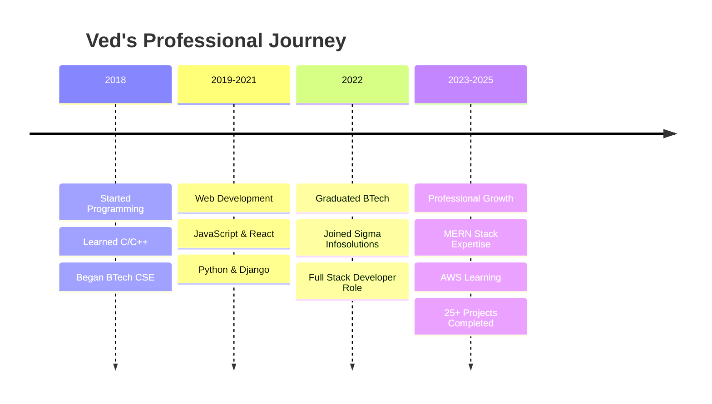

<div align="center">
  
  <!-- Animated typing header -->
  
  
  <br>
  
  <!-- Profile Picture with border animation -->
  
  
  <br><br>
  
  <!-- Enhanced Social Badges -->
  <div id="badges">
    <a href="https://www.linkedin.com/in/vedsharma8877">
      
    </a>
    <a href="https://www.instagram.com/vedsharma8877">
      
    </a>
    <a href="https://vedsharma.netlify.app/">
      
    </a>
    <a href="https://drive.google.com/file/d/1wgTl7IdpIl4xfxm7kGGKpHaGLCRHdQss/view?usp=sharing">
      
    </a>
  </div>
  
  <br>
  
  <!-- Visitor Counter with style -->
  
  
  <!-- Followers -->
  
  
  <br><br>
  
  <!-- Current Status -->
  
  
  
  
  <br><br>
  
  <!-- Coding GIF -->
  
  
</div>

---

## 🚀 About Me


```yaml
name: Ved Sharma
located_in: India
current_job: Full Stack Developer @ Sigma Infosolutions Ltd
education: 
  - "BTech Computer Science Engineering (2018-2022)"
company: "Sigma Infosolutions Ltd"
experience: "3+ Years (2022 - Present)"

fields_of_interests:
  - "Web Development"
  - "Cloud Computing"
  - "Data Structures & Algorithms"
  - "System Design"
  
technical_background:
  - "Full Stack Development"
  - "Cloud Technologies (AWS)"
  - "Database Management"
  - "API Development"
  
currently_learning: 
  - "Advanced AWS Services"
  - "System Design"
  - "Data Structures & Algorithms"
  - "Microservices Architecture"
```

### 🎯 Quick Facts
- 🔭 I'm currently working on **Full Stack Web Applications**
- 🌱 I'm learning **AWS Cloud Services** and **Advanced DSA**
- 👯 I'm looking to collaborate on **Open Source Projects**
- 🤔 I'm looking for help with **System Design** and **Scalable Architecture**
- 💬 Ask me about **React, Node.js, MongoDB, PostgreSQL**
- ⚡ Fun fact: I can debug code faster than I can decide what to eat for lunch! 🍕
- 📚 When not coding, you'll find me binge-watching sci-fi series or reading tech blogs

---

## 🏆 Achievements & Certifications

<div align="center">
  
  
  
  
  
  
</div>

---

## 💼 Experience Timeline

<div align="center">

### 🚀 Professional Journey

<table>
<tr>
<td width="15%" align="center"><strong>📅 Timeline</strong></td>
<td width="20%" align="center"><strong>🎯 Role/Status</strong></td>
<td width="35%" align="center"><strong>🏢 Organization/Focus</strong></td>
<td width="30%" align="center"><strong>📝 Description</strong></td>
</tr>
<tr>
<td align="center"><code>2022 - Present</code><br><sub>(3+ Years)</sub></td>
<td align="center">🚀 <strong>Full Stack Developer</strong></td>
<td align="center">🏢 <strong>Sigma Infosolutions Ltd</strong></td>
<td align="center">Professional development with MERN stack, building scalable web applications</td>
</tr>
<tr>
<td align="center"><code>2018 - 2022</code><br><sub>(4 Years)</sub></td>
<td align="center">🎓 <strong>BTech Student</strong></td>
<td align="center">📚 <strong>Computer Science Engineering</strong></td>
<td align="center">Foundation in CS fundamentals, algorithms, and software development</td>
</tr>
<tr>
<td align="center"><code>2018</code></td>
<td align="center">💡 <strong>Coding Journey Began</strong></td>
<td align="center">🌱 <strong>Self Learning</strong></td>
<td align="center">Started programming with C/C++, discovered passion for technology</td>
</tr>
</table>

### 📈 Career Progression



</div>

---

## 🛠️ Tech Stack & Skills

<div align="center">

### 🎨 Frontend Development
<div>

<br><br>


</div>

### 🔧 Backend Development
<div>

<br><br>


</div>

### 🗄️ Databases
<div>

<br><br>


</div>

### ☁️ Cloud & DevOps
<div>

<br><br>


</div>

### 🔧 Tools & IDEs
<div>

<br><br>


</div>

### 💻 Programming Languages
<div>

<br><br>


</div>

</div>

---

## 📊 Skill Proficiency

<table>
<tr>
<td width="50%">

**Frontend Technologies**
```text
React.js         ████████████████████ 95%
JavaScript       ████████████████████ 90%
TypeScript       ████████████████░░░░ 80%
HTML/CSS         ████████████████████ 95%
Redux            ████████████████░░░░ 80%
Material-UI      ████████████████░░░░ 85%
TailwindCSS      ████████████████░░░░ 80%
```

</td>
<td width="50%">

**Backend Technologies**
```text
Node.js          ████████████████████ 90%
Express.js       ████████████████████ 85%
Python           ████████████████░░░░ 80%
Django           ████████████████░░░░ 75%
REST APIs        ████████████████████ 90%
GraphQL          ████████████████░░░░ 70%
```

</td>
</tr>
<tr>
<td width="50%">

**Database & Cloud**
```text
MongoDB          ████████████████████ 90%
PostgreSQL       ████████████████░░░░ 85%
MySQL            ████████████████░░░░ 80%
AWS              ████████████░░░░░░░░ 60%
Azure            ████████████░░░░░░░░ 65%
Docker           ████████████░░░░░░░░ 60%
```

</td>
<td width="50%">

**Tools & Others**
```text
Git              ████████████████████ 95%
Linux            ████████████████░░░░ 80%
VS Code          ████████████████████ 95%
Jira             ████████████████░░░░ 85%
Jest             ████████████████░░░░ 75%
```

</td>
</tr>
</table>

---

## 🌟 Featured Projects

<div align="center">

<table>
<tr>
<td width="50%">
<h3 align="center">🎯 Project One</h3>
<div align="center">  
<a href="https://vedsharma.netlify.app/" target="_blank"></a>  
<a href="https://nodejs.org/" target="_blank"></a>  
<a href="https://www.mongodb.com/" target="_blank"></a>  
</div>
<p><strong>MERN Stack Application</strong> - Full-featured web application with authentication, CRUD operations, and responsive design.</p>
</td>
<td width="50%">
<h3 align="center">🚀 Project Two</h3>
<div align="center">  
<a href="https://aws.amazon.com/" target="_blank"></a>  
<a href="https://www.python.org/" target="_blank"></a>  
<a href="https://www.docker.com/" target="_blank"></a>  
</div>
<p><strong>Cloud-Based Solution</strong> - Scalable microservices architecture deployed on AWS with CI/CD pipeline.</p>
</td>
</tr>
</table>

</div>

---

## 💭 Philosophy & Quotes

<div align="center">
  
*"Code is like humor. When you have to explain it, it's bad."* – Cory House

*"The best error message is the one that never shows up."* – Thomas Fuchs

*"First, solve the problem. Then, write the code."* – John Johnson

</div>

---

## 📈 GitHub Analytics

<div align="center">
  


</div>

<div align="center">
  
[](https://git.io/streak-stats)

</div>

<div align="center">


</div>

---

<!-- ## 🐍 Contribution Snake

<div align="center">
  


</div>

--- -->

## 🏅 GitHub Trophies

<div align="center">
  
[](https://github.com/ryo-ma/github-profile-trophy)

</div>

---

## 📊 Coding Stats

<div align="center">

<!--START_SECTION:waka-->
```text
💬 Programming Languages:
JavaScript   ████████████████████░   80.5%
TypeScript   ███████░░░░░░░░░░░░░░░   28.3%
Python       ████░░░░░░░░░░░░░░░░░   16.2%
CSS          ███░░░░░░░░░░░░░░░░░░   12.7%
HTML         ██░░░░░░░░░░░░░░░░░░░    8.9%
```
<!--END_SECTION:waka-->

</div>

---

## 💡 LeetCode Progress

<div align="center">


</div>

<!-- ---

## 🎵 Spotify Playing

<div align="center">

[](https://open.spotify.com/user/31dqikdzd2upaolda5i767chcsvm)

</div> -->

---

## 📫 Let's Connect

<div align="center">

### 💌 Contact Me

<a href="mailto:vedsharma8877@gmail.com">

</a>
<a href="https://www.linkedin.com/in/vedsharma8877">

</a>
<a href="https://www.instagram.com/vedsharma8877">

</a>
<a href="https://vedsharma.netlify.app/">

</a>

### 📋 Resume

<a href="https://drive.google.com/file/d/1wgTl7IdpIl4xfxm7kGGKpHaGLCRHdQss/view?usp=sharing">

</a>

---

<div align="center">
  
**💖 Thanks for visiting my profile! 💖**

*Show some ❤️ by starring some of my repositories!*

</div>

---

<div align="center">
  


</div>

</div>

